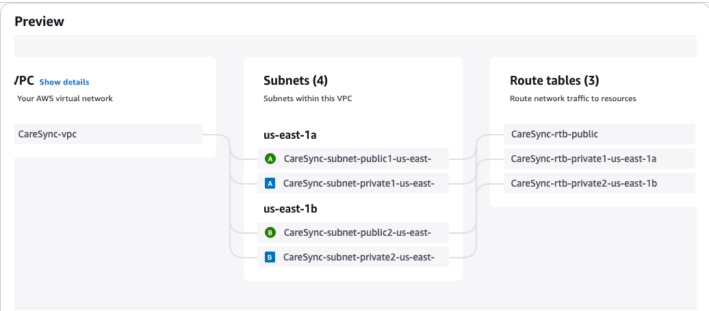
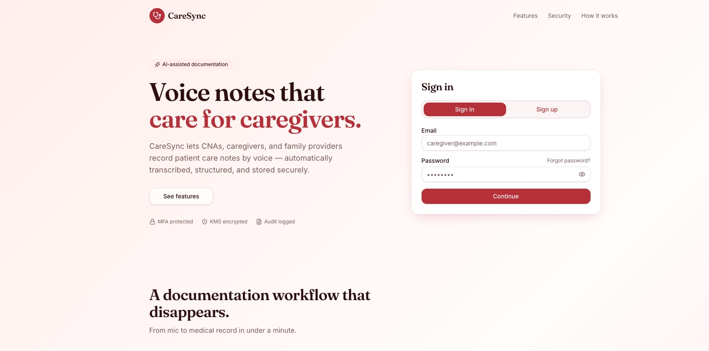
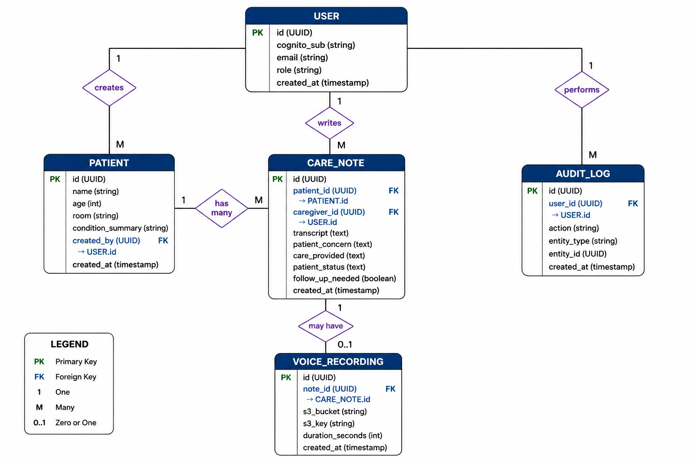
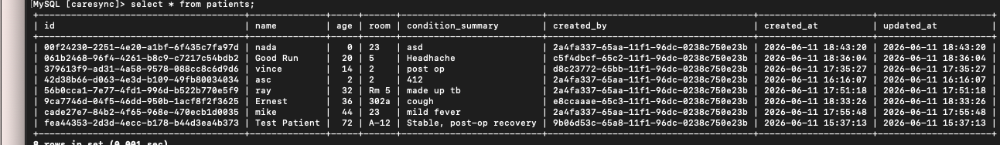

## Atnafu Ayalew

<!--
**atnafb/atnafb** is a ✨ _special_ ✨ repository because its `README.md` (this file) appears on your GitHub profile. -->

## Featured Project: CareSync 
### Cloud Based Clinical Documentation System 
CareSync is a cloud-native healthcare application that enables caregivers to create and manage patient care notes through a secure web platform. 

My Role:** AWS Cloud Architecture & Database Engineer

### Key Contributions 

- Designed a secure AWS VPC architecture with public and private subnets across multiple Availability Zones
- Deployed Amazon RDS MySQL in private subnets with controlled access through security groups
- Designed and implemented the CareSync relational database schema and ERD
- Configured secure Lambda-to-RDS communication for serverless data processing
- Authored CloudFormation templates for infrastructure deployment and documentation
- Supported AWS architecture reviews, testing, and deployment validation

### Technologies 

- AWS VPC
- Amazone RDS (MySQL)
- AWS Lambda 
- Amazon API Gateway 
- Amazon Cognito 
- GitHub Actions
- MySQL 
- TypeScript 

### Repositories 
[CareSync](https://github.com/vbanks-softcloud/CareSync)

## CareSync AWS Architecture 

## CareSync Application Dashboard 

## Database Design 

## Database Validation 

